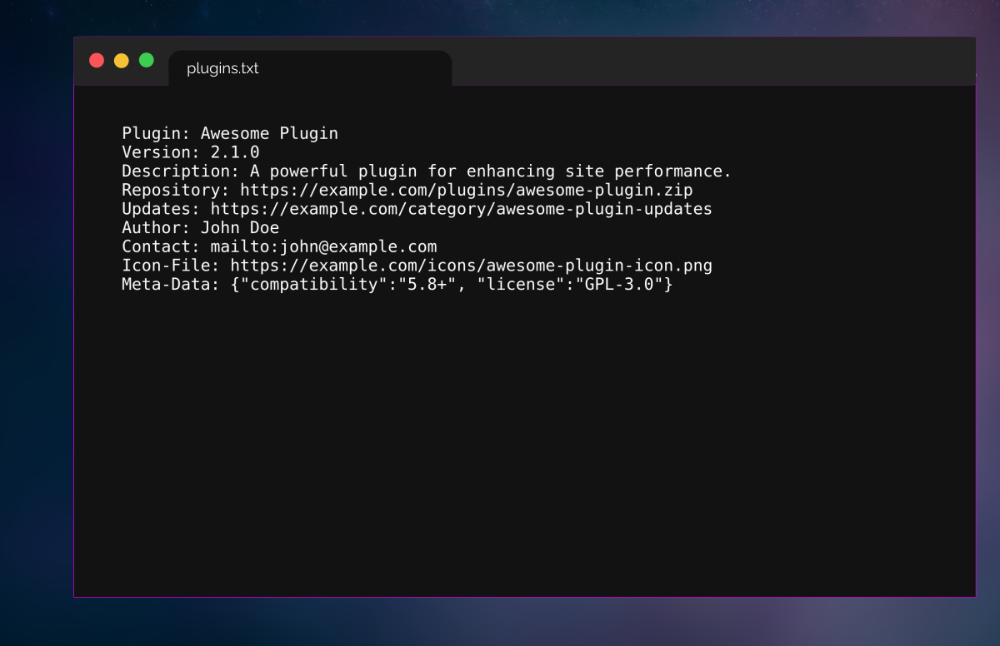

# pluginstxt
A proposed standard to decentralize hosting of WordPress plugins and offer an alternative to centralized plugin repositories.


<a href="#"></a>

### Summary
Developers and website owners rely heavily on WordPress plugins to enhance functionality. Currently, the central repository at WordPress.org holds a dominant position in plugin distribution. `plugins.txt` aims to decentralize plugin hosting by allowing developers to self-host and provide necessary metadata for discovery, verification, and secure communication.

### Example use case:
- A developer releases a plugin update and self-hosts it with all relevant details in a `plugins.txt` file.
- Users and decentralized platforms can access this file to find the latest updates, documentation, and security practices without relying on a centralized repository.

---

### Instructions for Implementation

#### Step 1: Create the `plugins.txt` file
The `plugins.txt` file should be placed under the `.well-known` directory of your website or plugin host, or/and in the root directory for maximum accessibility.

#### Example File Structure

### File Structure for Multiple Plugins


```
Plugin Name: Awesome Plugin
Version: 2.1.0
Description: A powerful plugin for enhancing site performance.
Repository: https://example.com/plugins/awesome-plugin.zip
Checksum-Sha256: d2d2d2e5931b9ecff1f5b5c5ff5f6d9e3d3e0f2e1e3a7a7d6d7d8e9a6a5f9f3
Updates: https://example.com/category/awesome-plugin-updates
Author: John Doe
Contact: mailto:john@example.com
Icon-File: https://example.com/icons/awesome-plugin-icon.png
License: GPL-3.0
Meta-Data: {"compatibility":"5.8+"}

Plugin Name: Super Plugin
Version: 3.0.5
Description: An all-in-one solution for managing SEO and analytics.
Repository: https://example.com/plugins/super-plugin.zip
Checksum-Sha256: a3b3c4d6e7f8e9b1b1c2c3d4e5f6a7b8c9d0e0f2a3c5f6d7e8f1f2e9d0c1e3b4
Updates: https://example.com/category/super-plugin-updates
Author: Jane Smith
Contact: mailto:jane@example.com
Icon-File: https://example.com/icons/super-plugin-icon.jpg
License: MIT
Meta-Data: {"compatibility":"5.9+"}
```

---

### Field Descriptions for Each Plugin

- **Plugin Name** (Required)  
  The name of the plugin.

- **Version** (Required)  
  The current version of the plugin. Update this field with each new release.

- **Description** (Required)  
  A short description (one sentence) summarizing the main function or feature of the plugin.

- **Repository** (Required)  
  A direct URL to the downloadable plugin file (e.g., a .zip file or hosted repository like GitHub). This should always link to the latest stable version.

- **Updates** (Required)  
  A URL where users can check for updates, release notes, or changelogs for the plugin. This could be a blog category, RSS feed, or dedicated update page.

- **Checksum-Sha256** (Required):
A SHA-256 checksum hash of the plugin file. This is crucial for verifying the integrity of the plugin by comparing the hash of the downloaded file with the one provided in the plugins.txt file.

- **License** (Required):
The licensing under which the plugin is distributed (e.g., GPL-3.0, MIT, etc.). It ensures that users know the legal permissions and restrictions of using the plugin.

- **Author** (Required)  
  The name of the person or organization responsible for maintaining the plugin.

- **Contact** (Required)  
  An email or contact form link for users to reach out for support or questions. Use `mailto:` for email addresses or `https://` for contact forms.

- **Icon-File** (Optional)  
  A direct URL to the plugin’s icon or logo file (e.g., a PNG or JPG image), representing the plugin. Recommended dimensions of 512x512 (1:1 ratio).

- **Meta-Data** (Optional)  
  A JSON-encoded string to include any additional optional information (e.g., WordPress compatibility, license, additional tags, etc.). This field is designed for future flexibility.

- **Cover-File** (Optional)  
  A direct URL to the plugin’s cover (e.g., a PNG or JPG image), representing the plugin. Recommended dimensions: 1200x400 to 1920x600 pixels (16:9 ratio).

### Step 2: Hosting Your Plugins Decentralized
- Once your `plugins.txt` file is ready, self-host it on your website or plugin server.

### Step 3: Updates
- Make sure the repository link is accessible, and periodically update the file as needed.

---

### Frequently Asked Questions

**What is the purpose of `plugins.txt`?**  
The goal is to decentralize plugin hosting and provide an alternative to WordPress.org, enabling developers to maintain control over distribution, updates, and communication.

**Where should the `plugins.txt` file be placed?**  
It should be placed under the `.well-known` directory (e.g., `/.well-known/plugins.txt`) or in the root directory for broader accessibility.

**Will adding my email address expose me to spam?**  
To minimize spam, consider using a web form link instead of a direct email address.

---

#### Plugin developer?
Join us at <a href="https://discord.gg/e4NkSj28">Discord</a>

